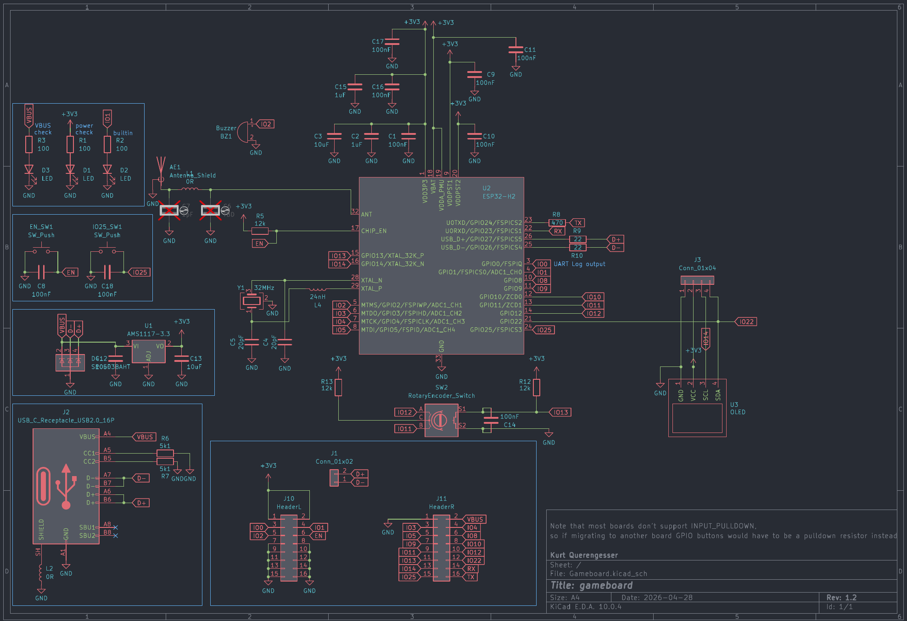
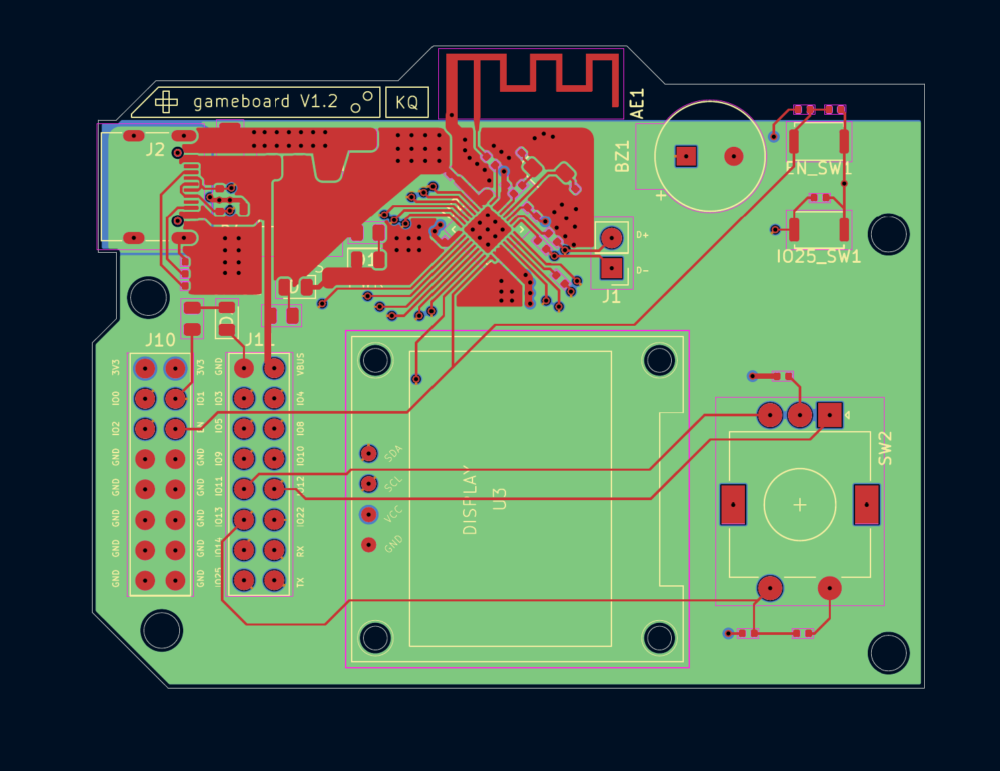
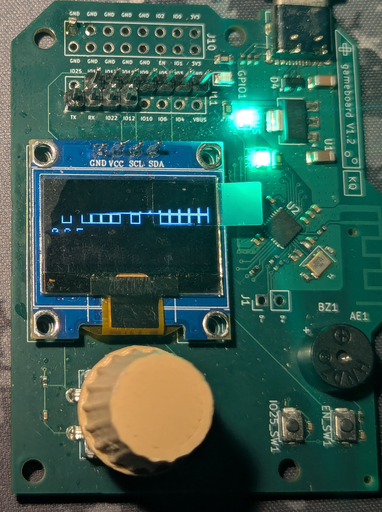

"Gameboard" is a little PCB I made as a side project for my portfolio. It features the classic arcade-style game of brick breaker written completely from scratch aside from some helper libraries.
It is a custom PCB that features an ESP32-H2 chip. It exposes GPIO for user input from buttons, a rotary encoder, a buzzer, a OLED display, some LEDs, and a USB-C debugging/programming port.
It features BLE (bluetooth) / IEEE 802.15.4, which currently remains unused, but has been tested for functionality.

